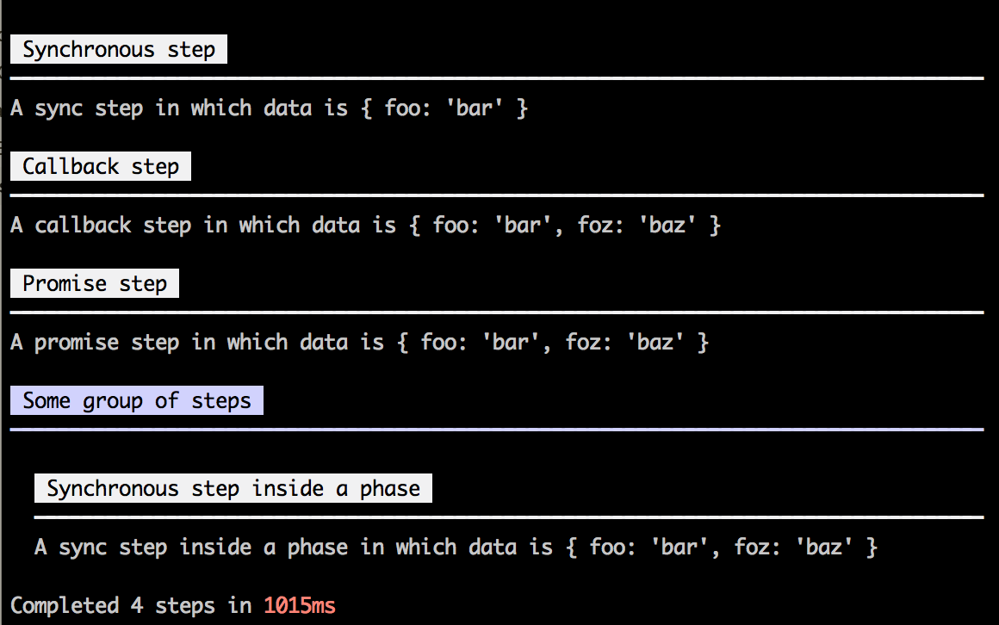
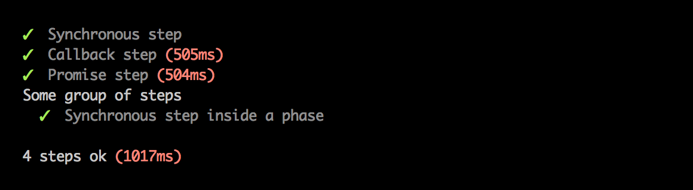
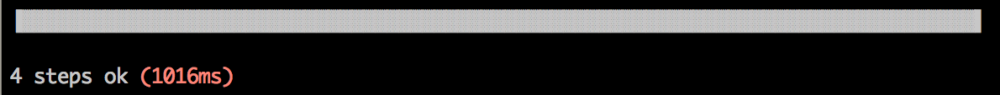

# planify

[![NPM version][npm-image]][npm-url] [![Downloads][downloads-image]][npm-url] [![Build Status][travis-image]][travis-url] [![Coverage Status][coveralls-image]][coveralls-url] [![Dependency status][david-dm-image]][david-dm-url] [![Dev Dependency status][david-dm-dev-image]][david-dm-dev-url]

[npm-url]:https://npmjs.org/package/planify
[downloads-image]:http://img.shields.io/npm/dm/planify.svg
[npm-image]:http://img.shields.io/npm/v/planify.svg
[travis-url]:https://travis-ci.org/IndigoUnited/node-planify
[travis-image]:http://img.shields.io/travis/IndigoUnited/node-planify.svg
[coveralls-url]:https://coveralls.io/r/IndigoUnited/node-planify
[coveralls-image]:https://img.shields.io/coveralls/IndigoUnited/node-planify.svg
[david-dm-url]:https://david-dm.org/IndigoUnited/node-planify
[david-dm-image]:https://img.shields.io/david/IndigoUnited/node-planify.svg
[david-dm-dev-url]:https://david-dm.org/IndigoUnited/node-planify#info=devDependencies
[david-dm-dev-image]:https://img.shields.io/david/dev/IndigoUnited/node-planify.svg

Plan a series of concrete steps and display their output in a beautiful way.

Ever wanted to write a simple CLI that run a series of tasks with beautiful output? I did and I always ended up doing a thin wrapper repeatedly. This library provides a concise way to define these tasks while offering a handful of reporters to output the progress in a variety of ways.


## Installation

`$ npm install planify`


## Usage

The API is very simple, yet very powerful:

```js
const planify = require('planify');

planify({ reporter: 'blocks' })  // 'blocks' is the default reporter
.step('Synchronous step', (data) => {
    console.log('A sync step in which data is', data);
    data.foz = 'baz';  // Set some data to the next step
})
.step('Callback step', (data, done) => {
    console.log('A callback step in which data is', data);
    setTimeout(done, 500);
})
.step('Promise step', (data) => {
    console.log('A promise step in which data is', data);
    return new Promise((resolve) => {
        setTimeout(resolve, 500);
    });
})
.phase('Some group of steps', (phase) => {
    phase.step('Synchronous step inside a phase', (data) => {
        console.log('A sync step inside a phase in which data is', data);
    });
})
.run({ foo: 'bar' })
// Run returns a promise but callback style is also supported
.then(() => process.exit(), (err) => process.exit(1));
```

You can build as many nested phases as you wish. API is chainable to make it easier to build your plan.

Running this would look like this:



But changing the reporter to `spec` would look like this:



This is very similar to the [mocha](https://github.com/mochajs/mocha)'s spec reporter isn't it? In fact a lot of the API was inspired in it. Finally, changing the reporter to `progress` would show a beautiful progress bar instead:



As you can see, changing the appearance of the output is very easy. You may even allow your CLI users to choose the reporter by mapping `--reporter` to `options.reporter` by using [yargs](https://github.com/bcoe/yargs) or something similar. Cool huh?


### Reporters

The are several built-in reporters:

- `blocks`: blocks is the default reporter and it outputs everything, including stuff printed to the stdout and stderr.
- `spec`: spec reporter is very similar to mocha's spec reporter but stuff written to the stdout and stderr are hidden.
- `progress`: progress reporter shows a beautiful progress bar showing the overall progress of the plan; stuff written to the stdout and stderr are hidden.
- `json`: json reporter outputs a machine readable object with all the plan lifecycle events.
- `silent`: silent reporter which simply outputs nothing.
- `spinner`: a simple reporter which prints errors or a spinner when the process is running.

You can easily make your own reporter. Take a look at the [json](./reporters/json.js) reporter implementation for an example. You may use a custom reporter like this:

```js
// my-reporter.js
function myReporter(options) {
    /* ... */

    return {
        plan: {
            start() { /* ... */ },
        },
    };
}

module.exports = myReporter;

// example.js
const planify = require('planify');
const myReporter = require('./my-reporter');

const plan = planify({
    reporter: myReporter({ /* reporter options if any */ })
});

/* ... */
```

One cool feature of the reporters is that they can be async. You may return promises or use callbacks to do async reporting (.e.g.: save stuff to a database).

Feel free to make a PR to add your reporter to the built-in reporters.


### Full API

#### planify([options])

Creates a plan with the `given` options.

Available options:

- `reporter`: The reporter to be used which can be a string or a reporter object, defaults to `blocks`.
- `exit`: True to exit automatically after running, defaults to `false`. If the plan fails with an error that has `err.exitCode`, the program will exit with that code.


```js
const planify = require('planify');
const plan = planify({ exit: true, reporter: 'spec' });
```

#### .step(label, [options], fn)

Adds a step with `label`, executing `fn` when it's time for the step to run.

The `fn` function will receive the plan `data` as the first argument which allows you to pass data to other steps.
As show above, `fn` may return a promise or use callbacks to do asynchronous stuff.

Available options:

- `fatal`: False to continue executing if this step fails, defaults to `true`.
- `mute`: True to mute stdout and stderr completely during the execution of this step independently of the reporter being used , defaults to `false`; stdout and stderr can be muted independently by passing an object, e.g.: `{ stdout: true, stderr: false }`.
- `slow`: Amount of time in ms to consider this step slow, defaults to `200`.


```js
const planify = require('planify');
const plan = planify();

plan.step('Some cool step', { fatal: false }, (data) => {
    throw new Error('This will fail but continue to the next step');
});
plan.step('Some cool step', { mute: true }, (data) => {
    console.log('This will not be logged');
});
plan.step('Some cool step', { slow: 500 }, (data, done) => {
    // Will be considered slow
    setTimeout(done, 600);
});
```

#### .phase(label, fn)

Adds a phase with `label` to the plan, executing `fn` with a `phase` object to define the phase plan.

The `phase` object has the `step` and `phase` methods, allowing you to build a hierarchy of other phases and steps.


```js
const planify = require('planify');
const plan = planify();

plan.phase('Phase 1', (phase) => {
    phase.step('Inner step', () => {});
    phase.phase('Inner phase', () => {});
});
```

#### .run([data])

Runs the plan.
Returns a promise that will be resolved when the plan succeeds or rejected if any of the steps failed.
You may pass a callback as the second argument instead.


```js
const planify = require('planify');
const plan = planify();

plan.step('Some cool step', (data) => {
    /* ... */
});

plan.run({ initial: 'data' })
.then(() => process.exit(0), () => process.exit(1));

// or you may use callback style
plan.run({ initial: 'data' }, (err) => {
    process.exit(err ? 1 : 0);
});
```

#### .getReporter()

Returns the configured reporter.

#### .getNode()

Returns the plan node, giving access to the plan tree. Use this at your own risk.


### Caveats

`planify` hooks into `process.stdout.write` and `process.stderr.write` to allow reporters to style or mute output done inside steps.
Thought, it's impossible to do that when using `child_process#spawn` or `child_process#exec` with `options.stdio` set to `inherit`. Please avoid it and listen to `data` events from stdout and stderr instead:

```js
// Example using child_process#spawn
const spawn = require('cross-spawn-async');
const planify = require('planify');

planify({ exit: true })
.step('Executing npm install', (done) => {
    const npm = spawn('npm', ['install']);  // Use cross-spawn to make this work on Windows

    npm.stdout.on('data', (buffer) => process.stdout.write(buffer));
    npm.stderr.on('data', (buffer) => process.stderr.write(buffer));

    npm.on('error', done);
    npm.on('exit', (code) => {
        done(code ? new Error('npm exited with code ' + code) : null);
    });
})
.run();
```

```js
// Example using child_process#exec
const cp = require('child_process');
const planify = require('planify');

planify({ exit: true })
.step('Executing npm install', (done) => {
    // Note that output is buffered :(
    cp.exec('npm install', (err, stdout, stderr) => {
        stdout && process.stdout.write(stdout);
        stderr && process.stderr.write(stderr);
        done(err);
    });
})
.run();
```


## Tests

`$ npm test`   
`$ npm test-cov` to get coverage report


## License

Released under the [MIT License](http://www.opensource.org/licenses/mit-license.php).
